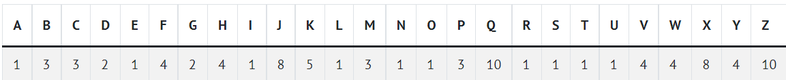

## Lab 2: [Scrabble](https://cs50.harvard.edu/x/2021/labs/2/#lab-2-scrabble)

Determine which of two Scrabble words is worth more.

### Background
In the game of Scrabble, players create words to score points, and the number of points is the sum of the point values of each letter in the word.


For example, if we wanted to score the word Code, we would note that in general Scrabble rules, the C is worth 3 points, the o is worth 1 point, the d is worth 2 points, and the e is worth 1 point. Summing these, we get that Code is worth 3 + 1 + 2 + 1 = 7 points.

#### How to Test Your Code
```
$ ./scrabble
Player 1: Oh,
Player 2: hai!
Player 2 wins!
--------------------
$ ./scrabble
Player 1: COMPUTER
Player 2: science
Player 1 wins!
--------------------
$ ./scrabble
Player 1: Scrabble
Player 2: wiNNeR
Player 1 wins! 
```